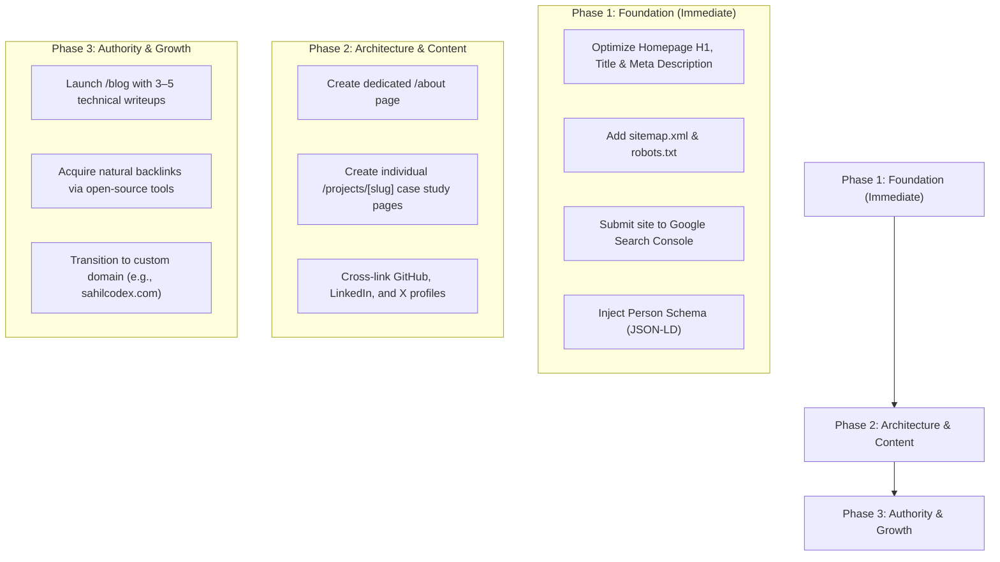

# SEO Strategy for SahilCodex

Comprehensive roadmap for ranking **sahilcodex.vercel.app**, establishing the **SahilCodex** personal brand entity on Google Search, and optimizing for AI discoverability across modern LLM search engines.

---

## Executive Summary

1. **Can a free** `.vercel.app`** domain rank?
  100% yes.** Google does not require a paid top-level domain (`.com`) to index and rank a website. Search engines prioritize crawlability, clear semantic content, topical authority, and brand trust signals.

2. **Core Objective:
  **When someone searches `"SahilCodex"`, Google and AI models should immediately associate that query with Sahil and showcase his portfolio, projects, and online presence.

3. **Three-Pillar Approach:**
  - **Personal Brand SEO:** Establish identity signals and cross-platform entity consistency.
  - **Technical SEO:** Clean URL hierarchy, metadata, semantic HTML, sitemaps, and structured data.
  - **AI Discoverability:** High crawlability, explicit entity definition, and authoritative mentions across the web.

---

## 1. Homepage & Identity Positioning

Avoid vague hero headlines such as `Building cool things 🚀`. Search engines and AI crawlers extract entity definitions directly from page text.

### Semantic Hero Example

```html height="320"
<h1>SahilCodex — Sahil's Developer Portfolio</h1>

<p>
  I'm Sahil, a developer and builder behind SahilCodex.
  I build web applications, AI-powered tools, and software projects.
</p>
```

### High-Context Hero Copy

> **SahilCodex — Sahil's Developer Portfolio
> 
> **I'm Sahil, a software developer and builder known online as** SahilCodex**. I build web applications, developer tools, and AI-powered projects. Explore my projects, technical work, experience, and writing.

Explicit text anchors the query `"SahilCodex"` directly to developer keywords and personal identity.

---

## 2. Page Title and Meta Tags

The `<title>` and `<meta name="description">` tags are fundamental search signals.

### Title Tags

| Type | Example | Assessment |
| --- | --- | --- |
| **Weak** | `<title>Portfolio</title>` | Generic; zero brand or keyword value |
| **Weak** | `<title>My Website</title>` | Lacks identity entirely |
| **Strong** | `<title>SahilCodex — Sahil's Developer Portfolio</title>` | Explicitly names brand, person, and site purpose |

### Meta Description

```html height="320"
<meta
  name="description"
  content="SahilCodex is the portfolio of Sahil, a developer and builder creating web applications, AI-powered tools, and software projects."
/>
```

**Key requirements:**

- Include your name (**Sahil**).
- Include your brand handle (**SahilCodex**).
- State clearly what you build (web applications, AI tools, developer software).

---

## 3. Multi-Page Site Architecture

Avoid housing all content on a single root route (`/`). A multi-page architecture gives search engines targeted URLs to index for distinct intent clusters.

### Recommended URL Structure

```
/
├── about/
├── projects/
│   ├── project-1/
│   └── project-2/
├── blog/
│   └── article-slug/
├── contact/
├── sitemap.xml
└── robots.txt
```

### Search Intent Mapping

- `SahilCodex` $\\rightarrow$ `/` (Homepage)
- `SahilCodex projects` $\\rightarrow$ `/projects`
- `[Project Name] by SahilCodex` $\\rightarrow$ `/projects/[slug]`
- `SahilCodex blog` / technical tutorials $\\rightarrow$ `/blog`

---

## 4. In-Depth Project Case Study Pages

Card grids with brief descriptions (e.g. `React`, `Next.js`, `GitHub`) provide minimal indexable text. Building dedicated case study pages for key projects creates rich, keyword-relevant content.

### Case Study Page Template

```markdown
# [Project Name]

A concise one-line summary of what the project achieves.

## What I Built
Detailed breakdown of the core features and functionality.

## Why I Built It
The specific problem solved or personal motivation behind the project.

## Technology Stack
- **Framework:** Next.js (App Router)
- **Language:** TypeScript
- **Database:** PostgreSQL (Prisma / Drizzle)
- **AI / APIs:** OpenAI API / Anthropic SDK

## Architecture & Design
Overview of system design, database schemas, and edge runtime considerations.

## Technical Challenges & Solutions
Real engineering obstacles encountered during development and how they were resolved.

## Results & Impact
Performance metrics, user feedback, or key learnings.

## Links
- **Live Demo:** [https://demo-link.com](https://demo-link.com)
- **Source Code:** [https://github.com/sahilcodex/repo-name](https://github.com/sahilcodex/repo-name)
```

---

## 5. Structured Data (Schema.org JSON-LD)

Structured data explicitly defines the entity graph for search engines like Google and Bing.

### `Person` Schema Example

Add this snippet inside the `<head>` of your portfolio or layout:

```html height="320"
<script type="application/ld+json">
{
  "@context": "https://schema.org",
  "@type": "Person",
  "name": "Sahil",
  "alternateName": "SahilCodex",
  "url": "https://sahilcodex.vercel.app",
  "jobTitle": "Software Developer",
  "sameAs": [
    "https://github.com/YOUR_GITHUB_HANDLE",
    "https://linkedin.com/in/YOUR_LINKEDIN_HANDLE",
    "https://x.com/YOUR_X_HANDLE"
  ]
}
</script>
```

> [!important]
> Keep schema strictly truthful. Data defined in JSON-LD must reflect visible, verifiable content on the website.

---

## 6. Unified Personal Brand Knowledge Graph

Connect online profiles bidirectionally so crawlers can identify **Sahil** and **SahilCodex** as the same entity.

```
                  ┌─── GitHub
                  ├─── LinkedIn
SahilCodex ───────┼─── X (Twitter)
 (Portfolio)      ├─── Dev.to / Hashnode
                  └─── Live Projects
```

### Linking Best Practices

- **Portfolio** $\\rightarrow$ **Profiles:** Prominent links in the navbar/footer to GitHub, LinkedIn, and X.
- **Profiles** $\\rightarrow$ **Portfolio:** Set website link to `https://sahilcodex.vercel.app` on GitHub, X, and LinkedIn bios.
- **Repositories** $\\rightarrow$ **Portfolio:** Reference `https://sahilcodex.vercel.app` in repo descriptions and `README.md` files.

---

## 7. Organic Mentions and Authoritative Backlinks

Avoid artificial backlink tactics. Focus on producing assets that naturally attract organic citations:

- Open-source packages (npm, PyPI) with links in docs.
- Public GitHub repositories with helpful documentation.
- High-quality technical articles published on Dev.to, Medium, or Hashnode linking to your portfolio.
- Participation in hackathons, community directories, and developer forums.

---

## 8. Technical Blog (`/blog`)

A dedicated blog enables ranking for broad technical queries and funnels targeted developer traffic to your portfolio.

### Example Blog Article Angles

- `/blog/how-i-built-my-ai-search-engine`
- `/blog/how-i-built-my-first-saas`
- `/blog/nextjs-performance-tips`
- `/blog/building-sahilcodex-portfolio`

### Discovery Flow

$$
\text{Searcher query (e.g. "Next.js AI tutorial")} \longrightarrow \text{Blog Post} \longrightarrow \text{Portfolio Discovery (SahilCodex)}
$$

---

## 9. Technical Essentials: Sitemaps and Robots.txt

### `sitemap.xml`

Ensure a valid sitemap is served at `https://sahilcodex.vercel.app/sitemap.xml` listing all canonical URLs (`/`, `/about`, `/projects`, `/blog/*`).

### `robots.txt`

Place at the root (`https://sahilcodex.vercel.app/robots.txt`):

```yaml
User-agent: *
Allow: /

Sitemap: https://sahilcodex.vercel.app/sitemap.xml
```

---

## 10. Google Search Console Setup

Google Search Console (GSC) is the primary feedback mechanism for search performance.

### Setup Checklist

1. Add property: `https://sahilcodex.vercel.app`.
2. Verify ownership (via HTML tag, HTML file, or DNS).
3. Submit sitemap: `/sitemap.xml`.
4. Monitor **Indexing Coverage**, **Search Queries**, **Impressions**, and **Click-Through Rates (CTR)**.
5. Use the **URL Inspection Tool** to verify whether new project/blog pages are indexed.

---

## 11. Domain Strategy: Free Domain vs Custom Domain

- **Current Stage (**`sahilcodex.vercel.app`**):** Perfectly fine for establishing initial crawl history, submitting to GSC, and ranking.
- **Long-term (**`sahilcodex.com`**):** Recommended for brand permanence, professional credibility, and independent email hosting. Vercel allows seamless custom domain mapping with automatic 301 redirects when transitioning.

---

## 12. AI Discoverability (GEO / LLM Optimization)

AI search engines (Perplexity, ChatGPT Search, Claude, Google AI Overviews) rely on standard web crawlers and well-structured web knowledge graphs.

> [!note]
> There are no proprietary files like `ai.txt` or `magic-ai-schema.json`. AI engines rely on explicit text definitions and trusted signals.

### Target AI Answer

When an LLM is asked *"Who is SahilCodex?"*, the objective is for it to synthesize:

> *"SahilCodex is the developer portfolio and online identity of Sahil, a software developer who builds web applications, AI tools, and open-source projects."*

### How to Facilitate AI Understanding

- Add a clear `/about` page defining your work and background.
- Keep factual statements direct and unambiguous.
- Maintain consistent bios across GitHub, LinkedIn, and X.

---

## 13. Priority Implementation Roadmap




---

## 14. Codebase Audit Checklist

When reviewing the portfolio repository code, verify the following items:

- [ ] `<title>` includes name, brand (`SahilCodex`), and role.
- [ ] Unique meta description configured per page.
- [ ] Proper heading hierarchy (`H1` $\\rightarrow$ `H2` $\\rightarrow$ `H3`) with only one `H1` per page.
- [ ] Open Graph (`og:title`, `og:description`, `og:image`, `og:url`) configured for link previews on social platforms.
- [ ] Canonical URLs set on all pages (`<link rel="canonical" href="..." />`).
- [ ] Dynamic or static `sitemap.xml` generated automatically on build.
- [ ] `robots.txt` properly configured and reachable.
- [ ] Schema.org JSON-LD (`Person` and `WebSite`) implemented.
- [ ] Images have descriptive `alt` tags and width/height dimensions.
- [ ] Core Web Vitals (LCP, CLS, INP) performance optimized.
